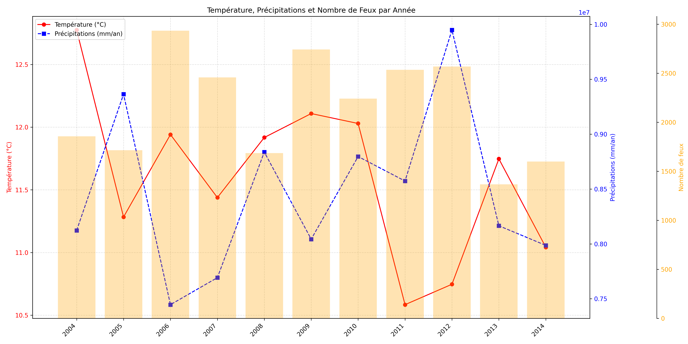
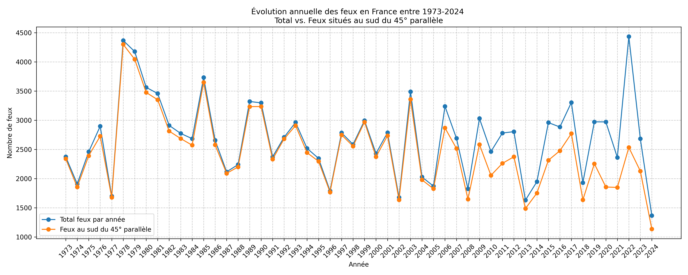

# Hackathon-Climat

# IA – Calcul du risque d’incendies en France

Ce projet vise à développer un **algorithme capable de prédire les probabilités d’incendies en France** à partir de données climatiques et historiques.  
Les données utilisées incluent :

- **Températures moyennes** (tas)  
- **Précipitations** (pr)  
- **Base de données des incendies historiques** (BDIFF) 

Nous avons effectué un pré-traitement des données de température et de précipitations afin d’en extraire davantage d’informations et d’améliorer la qualité des prédictions.
Cela inclut du feature engineering et du preprocessing des données pour rendre les modèles plus performants.

Nous avons ensuite entraîné un classificateur random forest qui prédit s'il y aura un incendie à un point et temps donné en utilisant le dataset que nous avons préparé et scikit-learn.

L’objectif est d’identifier les zones et périodes à fort risque d’incendie afin de mieux anticiper et gérer les feux futurs en France.

Notre solution vise à aider toutes personnes ayant un besoin de prévoir et/ou répondre à un potentiel incendie.

---

## Sources des datasets

### Données climatiques (historical + SSP370 – pr & tas)
Dataset EMULATEUR historique et scénario SSP370 (résolution R1)

Lien :  
https://www.data.gouv.fr/datasets/projections-climatiques-pour-le-hackathon-2025-socle-metropole/

### Données incendies (BDIFF)
Lien :  
https://www.data.gouv.fr/datasets/base-de-donnees-sur-les-incendies-de-forets-en-france-bdiff/

### Données INSEE (codes postaux / communes)
Lien : https://www.data.gouv.fr/datasets/base-officielle-des-codes-postaux/

---

## Dataset Hackathon – Série temporelle Température / Précipitations / Feux

**Description :**  
Série temporelle de la température, des précipitations et du nombre de feux par année entre 2004 et 2014 en France.  
- **Rouge** : température moyenne en France sur une année (°C)  
- **Bleu** : précipitations totales annuelles en mm (moyenne quotidienne intégrée)  
- **Histogramme** : nombre total de feux recensés par année

---

## Dataset Incendies et INSEE - Animation des feux recensés en France entre 1973 et 2024

**Description :**  
GIF du nombre de feux par année. Chaque point représente la localisation du code INSEE pour lequel un feu a été recensé.  
La couleur des points varie selon le nombre de feux enregistrés pour un point donné :

- **Bleu** : 1 feu comptabilisé  
- **Rouge** : plus de 5 feux recensés  

Image générée à partir des datasets **Incendies (BDIFF)** et **INSEE**.

---

## Dataset Incendies et INSEE - Serie temporelle du nombre de feux entre 1973 et 2024 

**Description :**  
Évolution temporelle du nombre de feux entre 1973 et 2024 en France.  
- **Bleu** : nombre total de feux par année  
- **Orange** : nombre de feux recensés sous le 45ᵉ parallèle (sud de la France) par année 

On observe qu’avant 2005, la majorité des feux étaient recensés dans le sud de la France, ce qui pourrait introduire un biais dans l’entraînement du modèle.

---

### **Retour sur les données exploitées**

Le format des fichiers .nc ne nous était pas familier, mais nous avons réussi à en extraire les informations dont nous avions besoin.

 
